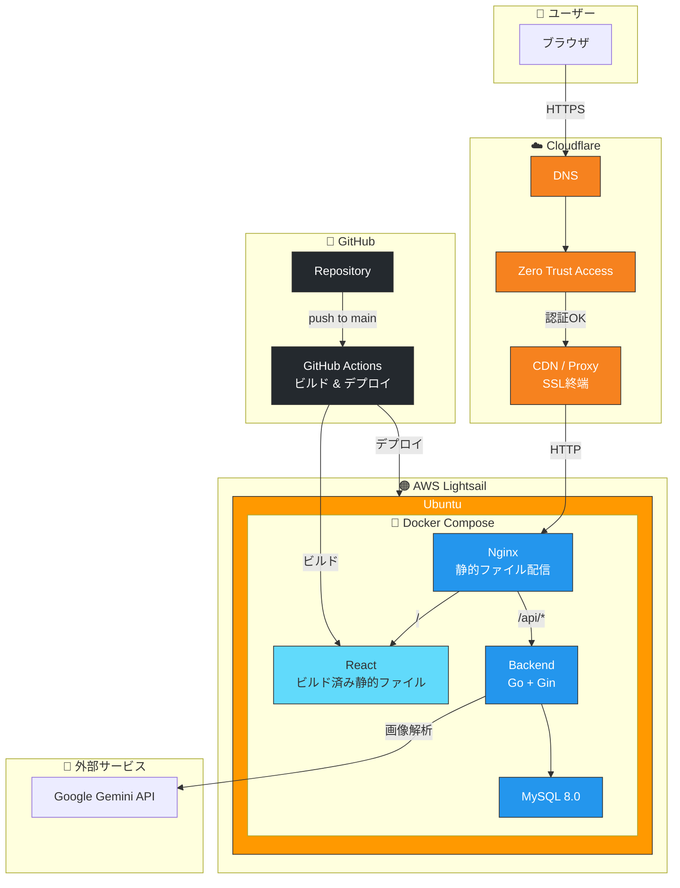

# CalTrack

カロリー管理アプリケーション

## インフラ構成



## 技術スタック

### Backend
- **言語**: Go 1.24
- **フレームワーク**: Gin
- **ORM**: GORM
- **DB**: MySQL 8.0
- **マイグレーション**: sql-migrate
- **ホットリロード**: Air
- **APIドキュメント**: Swagger (swaggo)

### Web (Frontend)
- **言語**: TypeScript
- **フレームワーク**: React + Vite
- **UIライブラリ**: shadcn/ui
- **スタイリング**: Tailwind CSS
- **ルーティング**: React Router
- **HTTP**: Axios
- **テスト**: Vitest + React Testing Library
- **コンポーネントカタログ**: Storybook

### Mobile (予定)
- **フレームワーク**: React Native + Expo
- **ルーティング**: Expo Router
- **スタイリング**: NativeWind

### インフラ
- Docker Compose

## 必要条件

- Docker
- Docker Compose

## セットアップ

```bash
# コンテナ起動
make up

# コンテナ停止
make down
```

## アクセス

| サービス | URL |
|---------|-----|
| Web | http://localhost:5173 |
| Backend API | http://localhost:8080 |
| Swagger UI | http://localhost:8080/swagger/index.html |
| Storybook | http://localhost:6006 |
| ヘルスチェック | http://localhost:8080/health |

## コマンド

`make help` で全コマンドを確認できます。

### 起動・停止

```bash
make up              # コンテナ起動
make down            # コンテナ停止
make restart         # コンテナ再起動
make clean           # コンテナとボリューム削除
```

### ログ

```bash
make logs            # 全サービスのログ
make logs-backend    # バックエンドのログ
make logs-frontend   # Webのログ
make logs-mysql      # MySQLのログ
```

### ビルド・テスト

```bash
make build           # 全サービスをビルド
make test            # 全テスト実行
make test-backend    # バックエンドテスト
make test-frontend   # Webテスト
make lint            # 全Lint実行
make fmt             # 全フォーマット実行
```

### ドキュメント

```bash
make swagger         # Swaggerドキュメント生成
make storybook       # Storybook起動（ポート6006）
make build-storybook # Storybookビルド
```

### マイグレーション

```bash
make migrate         # マイグレーション実行
make migrate-status  # マイグレーション状態確認
make migrate-down    # ロールバック（1つ戻す）
make migrate-new NAME=xxx  # 新規マイグレーション作成
```

### シェル

```bash
make shell-backend   # バックエンドコンテナに入る
make shell-frontend  # Webコンテナに入る
make shell-mysql     # MySQLコンテナに入る
```

## 仕様駆動開発

このプロジェクトでは**仕様駆動開発（Spec-Driven Development）** を採用しています。

### 仕様駆動開発とは

設計書（仕様）を先に作成し、承認を得てから実装に進む開発手法です。

**メリット:**
- 実装前に設計レビューができる
- 手戻りを最小限に抑えられる
- チーム間の認識齟齬を防げる

### 開発フロー

```
1. Issue作成
   ↓
2. 設計（プランナー）
   ↓
3. 設計承認 ← ユーザー確認
   ↓
4. 子Issue作成
   ↓
5. 実装（エンジニア）
   ↓
6. テスト（QA）
   ↓
7. テスト承認 ← ユーザー確認
   ↓
8. PR作成・マージ（DevOps）
```

### 承認ポイント

| ポイント | タイミング | 確認内容 |
|---------|-----------|---------|
| 設計承認 | 設計完了後 | 設計内容が要件を満たしているか |
| テスト承認 | テスト完了後 | PRを作成してよいか |

### チーム構成

| ロール | 役割 |
|-------|------|
| PM | 全体の進行管理、次のアクション判断 |
| プランナー | 設計書作成 |
| エンジニア | 実装 |
| QA | ビルド・テスト実行 |
| DevOps | Issue作成、PR作成・マージ |
| 技術リード | リファクタリング |

詳細は `.claude/agents/workflow.md` を参照してください。

## ディレクトリ構成

```
CalTrack/
├── backend/
│   ├── domain/           # VO, Entity, Domain Errors
│   │   ├── vo/
│   │   ├── entity/
│   │   └── errors/
│   ├── usecase/          # Usecase（ドメイン単位）
│   ├── infrastructure/   # 実装
│   │   ├── persistence/  # Repository実装
│   │   └── service/      # Service実装
│   ├── handler/          # HTTP層（ドメイン単位）
│   │   ├── common/       # 共通エラーコード・レスポンス
│   │   └── {domain}/     # dto/, handler.go
│   ├── config/           # DB設定
│   ├── docs/             # Swagger自動生成
│   └── migrations/       # sql-migrate
├── web/                   # Web版 (React + Vite)
│   ├── .storybook/       # Storybook設定
│   └── src/
│       ├── domain/       # DDD Domain層 (VO, Entity)
│       ├── features/     # 機能単位
│       │   └── {feature}/
│       │       ├── api/
│       │       ├── hooks/
│       │       └── components/
│       ├── components/ui/ # shadcn/ui
│       ├── pages/        # ページコンポーネント
│       ├── routes/       # React Router設定
│       ├── hooks/        # 共通Hooks
│       └── lib/          # ユーティリティ
├── mobile/                # モバイル版 (React Native + Expo)
│   ├── app/              # Expo Router (ファイルベースルーティング)
│   ├── components/       # RN用UIコンポーネント (NativeWind)
│   ├── features/         # RN用featureコンポーネント (UIのみ)
│   └── lib/              # RN固有ユーティリティ
├── packages/
│   └── shared/           # Web/Mobile共有コード
│       ├── domain/       # VO, Entity, Result型
│       ├── features/     # 共有hooks, helpers
│       └── lib/          # 共有ユーティリティ
└── Makefile
```

## 環境変数

| 変数 | 説明 | デフォルト値 |
|-----|------|------------|
| MYSQL_DATABASE | データベース名 | caltrack |
| MYSQL_USER | MySQL ユーザー名 | caltrack |
| MYSQL_PASSWORD | MySQL パスワード | caltrack |
| DB_HOST | データベースホスト | mysql |
| DB_PORT | データベースポート | 3306 |
| ENV | 環境 (production/test/development) | development |

## ポート

| サービス | ポート |
|---------|--------|
| Web | 5173 |
| Backend | 8080 |
| MySQL | 3307 |
| Storybook | 6006 |
